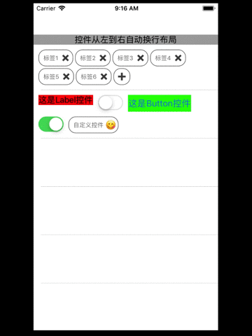

# YHFloatContainerView
仿照css的float浮动布局容器，子控件从左到右自动换行布局，常用于嵌套tableView里面

[](https://travis-ci.org/chenyehong/YHFloatContainerView)
[](https://cocoapods.org/pods/YHFloatContainerView)
[](https://cocoapods.org/pods/YHFloatContainerView)
[](https://cocoapods.org/pods/YHFloatContainerView)

## Features


## Example

To run the example project, clone the repo, and run `pod install` from the Example directory first.

## Requirements

## Installation

YHFloatContainerView is available through [CocoaPods](https://cocoapods.org). To install
it, simply add the following line to your Podfile:

```ruby
pod 'YHFloatContainerView', :git => 'https://github.com/yelinux/YHFloatContainerView.git'
```

## Author

chenyehong, ichenevan@126.com

## License

YHFloatContainerView is available under the MIT license. See the LICENSE file for more info.
